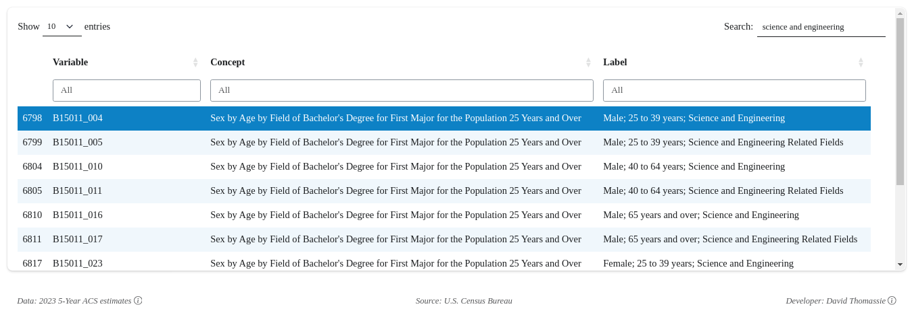

#

### Overview

A Shiny web application that provides interactive visualization of U.S. Census Bureau American Community Survey (2023 ACS 5-Year) data.

- Select from over 18,000 Census variables
- Explore a state's county-level demographic and economic information
- View data through an interactive plot and map interface
- Download county-specific CSV files for further analysis

*Known errors:*  
- *Complex variables may format improperly*  
- *Format for percentage estimates*  
- *All-zero estimates*

#

### Key Technologies

- [`R`](https://www.r-project.org): Statistical programming language for data processing, visualization, and app development
- [`tidyverse`](https://www.tidyverse.org): Meta-package containing data science tools that share underlying design philosophy, grammar, and data structures
- [`shiny`](https://shiny.posit.co): Web application framework for interactive data exploration
- [`bslib`](https://rstudio.github.io/bslib): Bootstrap-based theming for Shiny applications
- [`tidycensus`](https://walker-data.com/tidycensus): Accessing U.S. Census Bureau data
- [`mapgl`](https://walker-data.com/mapgl): Leverage MapLibre GL JS framework
- [`ggiraph`](https://davidgohel.github.io/ggiraph): Interactive graphics extension

#

### Data Sources and Methodology

- **Data Source**: U.S. Census Bureau American Community Survey (ACS)
- **Data Vintage**: 2023 5-Year Estimates (falls back to 2022 if 2023 data unavailable)
- **Geographic Level**: County-level data for selected state
- **Variables**: Dynamically loaded and processed from ACS variable metadata

#

### Technical Highlights

- Interactive state selection
- Dynamic plot and map rendering
- Downloadable county-level CSV exports
- Responsive design with custom Bootstrap theme
- Caches census variable metadata for performance
- Handles geospatial data for Alaska and Hawaii with geometry shifting
- Implements custom formatting for numerical scales
- Provides tooltips and interactive data exploration

#

&nbsp;&nbsp;&nbsp;
&nbsp;&nbsp;&nbsp;

*© 2024 David Thomassie; not affiliated with the U.S. Census Bureau*