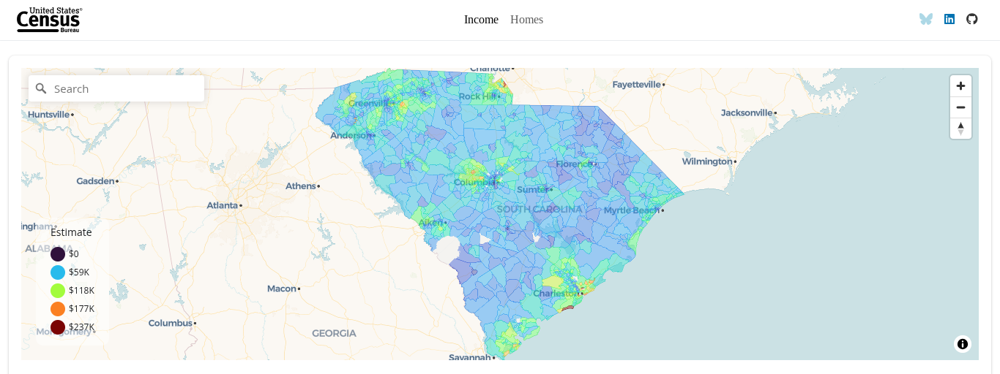
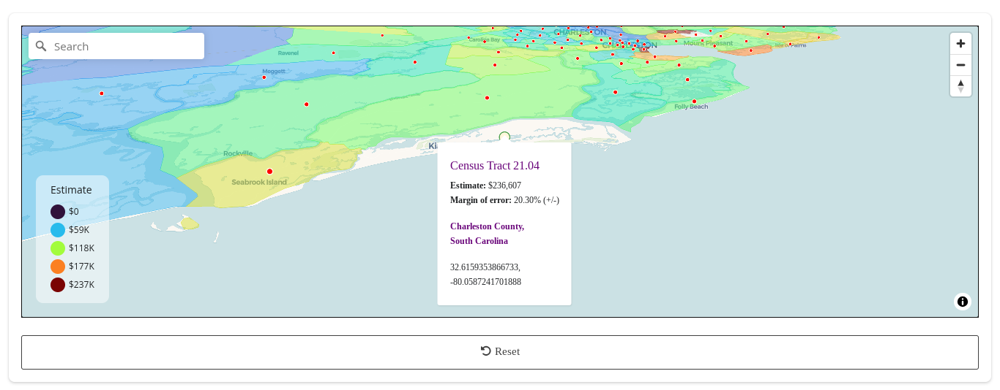

#

### Overview

A Shiny web application that visualizes income and home values across South Carolina census tracts using 2023 American Community Survey (ACS) 5-Year estimates.

- Explore median household income and home values by census tract
- Interact with an intuitive geospatial map visualization
- Zoom into specific areas and view detailed tract-level information
- Compare economic data across different regions of South Carolina

#

### Key Technologies

- [`R`](https://www.r-project.org): Statistical programming language for data processing, visualization, and app development
- [`tidyverse`](https://www.tidyverse.org): Meta-package containing data science tools that share underlying design philosophy, grammar, and data structures
- [`shiny`](https://shiny.posit.co): Web application framework for interactive data exploration
- [`bslib`](https://rstudio.github.io/bslib): Bootstrap-based theming for Shiny applications
- [`tidycensus`](https://walker-data.com/tidycensus): Accessing U.S. Census Bureau data
- [`mapgl`](https://walker-data.com/mapgl): Interactive mapping with MapLibre GL JS

#

### Data Sources and Methodology

- **Data Source**: 2023 5-Year American Community Survey (ACS) estimates
- **Geographic Level**: South Carolina census tracts
- **Key Variables**:
  - Median Household Income (B19013_001)
  - Median Home Value (B25077_001)
- **Data Processing**: 
  - Pull Census tract data
  - Calculate tract-level centroids
  - Prepare interactive map layers

#

### Technical Highlights

- U.S. Census Bureau API bridge for ACS 2023 5-year estimates
- MapLibre GL JS integration with custom zoom/pitch controls
- Interactive census tract visualization with viridis color scales
- Real-time geocoding and navigation controls
- Progress indicators for asynchronous map loading
- Custom tooltips with margin of error calculations

#

&nbsp;&nbsp;&nbsp;
&nbsp;&nbsp;&nbsp;

*© 2024 David Thomassie; not affiliated with the U.S. Census Bureau*