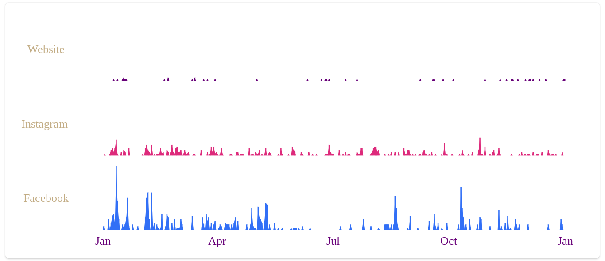
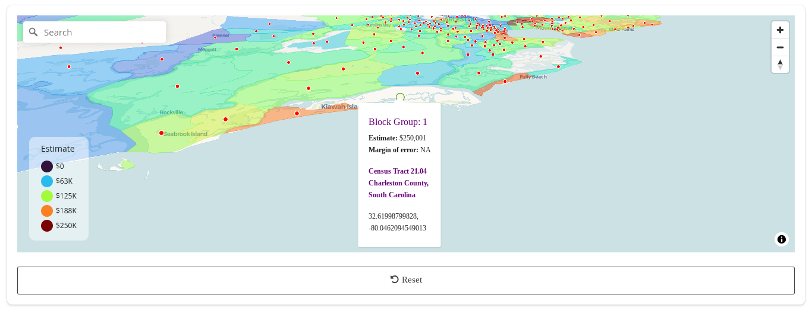
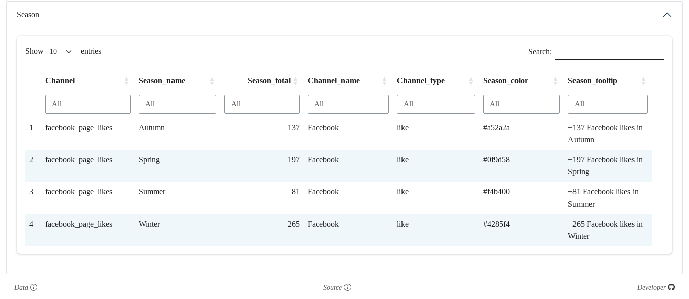

<a href="https://david-thomassie.shinyapps.io/saraphina-dashboard" target="_blank"></img></a>
<a href="https://david-thomassie.shinyapps.io/saraphina-dashboard" target="_blank"></img></a>
<a href="https://david-thomassie.shinyapps.io/saraphina-dashboard" target="_blank"></img></a>
<a href="https://david-thomassie.shinyapps.io/saraphina-dashboard" target="_blank"></img></a>

#

### Overview

An interactive R Shiny dashboard that visualizes social media engagement
metrics and demographic data for Saraphina Portraits, a photography business.
The dashboard tracks website clicks, Instagram followers, and Facebook page
likes across different time periods (yearly, monthly, weekly, and seasonal)
while also providing income-level analysis of potential customer base using
Census data. Built with modern data visualization libraries and styled with a
professional, brand-consistent design.

#

### Key Technologies

- [`R`](https://www.r-project.org): Statistical programming language for data processing, visualization, and app development
- [`tidyverse`](https://www.tidyverse.org): Meta-package containing data science tools that share underlying design philosophy, grammar, and data structures
- [`shiny`](https://shiny.posit.co): Web application framework for interactive data exploration
- [`bslib`](https://rstudio.github.io/bslib): Bootstrap-based theming for Shiny applications
- [`tidycensus`](https://walker-data.com/tidycensus): Accessing U.S. Census Bureau data
- [`mapgl`](https://walker-data.com/mapgl): Leverage MapLibre GL JS framework
- [`ggiraph`](https://davidgohel.github.io/ggiraph): Interactive graphics extension
- [`DT`](https://rstudio.github.io/DT): Interface to the DataTables JavaScript library

#

### Data Sources and Methodology

- **Web Analytics**: Google Search Console
- **Social Media Data**: Meta Business Suite platform (Facebook likes, Instagram followers)
- **Census Data**: U.S. Census Bureau 2023 ACS5 estimates
- **Temporal Aggregation**: Daily, monthly, and seasonal patterns
- **Geographic Level**: South Carolina block groups
- **Transparency**: Engagement data displayed in modern-themed tables

#

### Technical Highlights
- Interactive time-series visualizations with ggiraph
- Dynamic MapLibre GL JS integration for census data
- Geospatial data handling and visualization
- Efficient data caching and processing
- Data tables with filtering and sorting
- Custom tooltips and hover interactions
- Brand-consistent styling system
- Responsive design with bslib Bootstrap theme

#

&nbsp;&nbsp;&nbsp;
&nbsp;&nbsp;&nbsp;

*© 2024 David Thomassie; not affiliated with the U.S. Census Bureau*